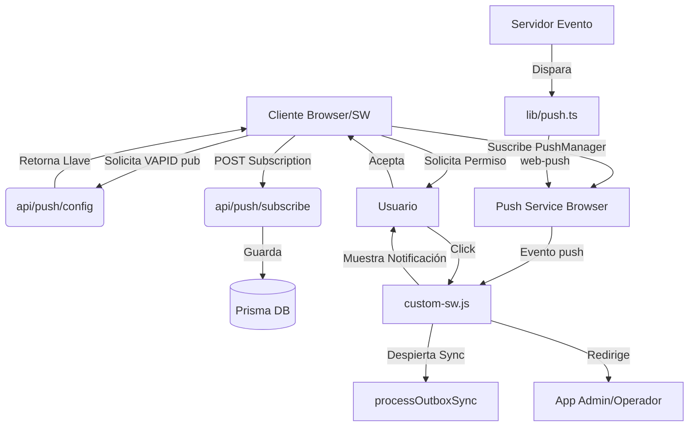

# ESTADO_NOTIFICACIONES.md — Aquatech CRM (PWA)

## 1. Propósito
Este documento resume la arquitectura, los archivos involucrados, el flujo de trabajo, los probables bugs conocidos y las áreas de mejora del sistema de **notificaciones push** (PWA) en Aquatech CRM.

> [!NOTE]
> Este documento fue generado a partir del análisis del chat: [Chat f49c2b17-40a8-4204-bb4f-24397b623e99](file:///C:/Users/Smart/.gemini/antigravity/brain/f49c2b17-40a8-4204-bb4f-24397b623e99/overview.txt)

## 2. Arquitectura General

- **Service Worker**: [custom-sw.js](file:///d:/Abel%20paginas/Aquatech/Crm%20Aquatech%20-%20cloudfare%204/public/custom-sw.js) (v315) escucha `push` y `notificationclick`.  
- **Cliente**: [usePushNotifications.ts](file:///d:/Abel%20paginas/Aquatech/Crm%20Aquatech%20-%20cloudfare%204/src/hooks/usePushNotifications.ts) hook gestiona ciclo de vida de suscripción.  
- **Servidor**: [push.ts](file:///d:/Abel%20paginas/Aquatech/Crm%20Aquatech%20-%20cloudfare%204/src/lib/push.ts) envía notificaciones y limpia suscripciones 410.  
- **API endpoints**: `/api/push/subscribe` (registro/borrado) y `/api/push/config` (VAPID pública).  
- **Manifest**: [manifest.json](file:///d:/Abel%20paginas/Aquatech/Crm%20Aquatech%20-%20cloudfare%204/public/manifest.json) con iconos y colores PWA.

## 3. Archivos Clave

### 3.1 `src/hooks/usePushNotifications.ts` (Cliente)
- Maneja obtención de permiso `Notification.requestPermission()`.
- Llama a `/api/push/config` para obtener la llave VAPID pública.
- Se suscribe mediante `registration.pushManager.subscribe`.
- Soporta **limpieza de llaves VAPID** (por si caducan) y **onboarding en móvil**.
- Sincroniza la suscripción con el servidor al iniciar.

### 3.2 `src/lib/push.ts` (Servidor)
- Utiliza `web-push` con llaves VAPID del entorno.
- Funciones exportadas:
  - `sendPushToUser(userId, payload)`
  - `sendPushToProjectTeam(projectId, excludeUserId, payload)`
  - `notifyAdmins(title, body, ...)`
- **Limpieza automática**: elimina suscripciones que responden con 410 (Gone).

### 3.3 `public/custom-sw.js` (Service Worker)
- **Evento `push`**:
  - Muestra notificación premium.
  - Llama a `processOutboxSync()` para despertar sincronización offline inmediatamente.
- **Evento `notificationclick`**:
  - Maneja redirecciones inteligentes:
    - `URL_PROJECT_CHAT:id` -> Redirige al chat (vista Admin u Operador).
    - `URL_TASK:projId:taskId` -> Redirige a la tarea en calendario o registros.
    - `URL_CALENDAR` -> Redirige al calendario general.
- **Vibración y Persistencia**: Patrón premium `[200, 100, 200, 100, 400]` y `requireInteraction: true`.

## 4. Flujo de Trabajo Completo

1. **Suscripción**: El usuario otorga permiso -> El navegador genera un endpoint -> El cliente lo envía al servidor -> Prisma lo guarda en `PushSubscription`.
2. **Notificación**: Ocurre un evento en el backend -> `push.ts` envía a todos los dispositivos registrados del usuario -> El Service Worker recibe el evento.
3. **Sincronización**: Al recibir el push, el SW ejecuta el outbox sync aunque la app esté cerrada.
4. **Interacción**: El usuario hace click -> El SW analiza la URL -> Enfoca la ventana existente o abre una nueva en la ruta correcta.

## 5. Puntos Pendientes y Áreas de Mejora

### 5.1 Bug crítico: Mensajes de chat que desaparecen
- **Problema**: Reportado que al enviar/recibir mensajes rápidos u offline, algunos desaparecen.
- **Posible Causa**: Concurrencia entre `processOutboxSync` del SW y la actualización de Dexie en el cliente.
- **Acción**: Hardened de `processOutboxSync` (v315+) ya implementó mejores bloqueos, pero falta verificar si el servidor está confirmando correctamente cada `sync-id`.

### 5.2 Mejoras de UX
- **DeviceId**: Diferenciar dispositivos para evitar duplicidad o permitir des-suscripción selectiva.
- **Iconos**: Asegurar que los iconos en `manifest.json` tengan versiones transparentes para Android.

## 6. Cómo Probar y Debug

### 6.1 Debug en SW
- Abrir `chrome://inspect/#service-workers`.
- Revisar la consola del Service Worker para ver logs de `[PUSH]`.

### 6.2 Test Manual
- Usar el endpoint `POST /api/push/test` (si existe o crearlo) para disparar una notificación de prueba a la sesión actual.
- Verificar el patrón de vibración en móvil real.

---
**Última actualización**: 2026-05-04  
**Estado general**: 🟢 Funcional / 🟡 Estabilizando sincronización offline.
